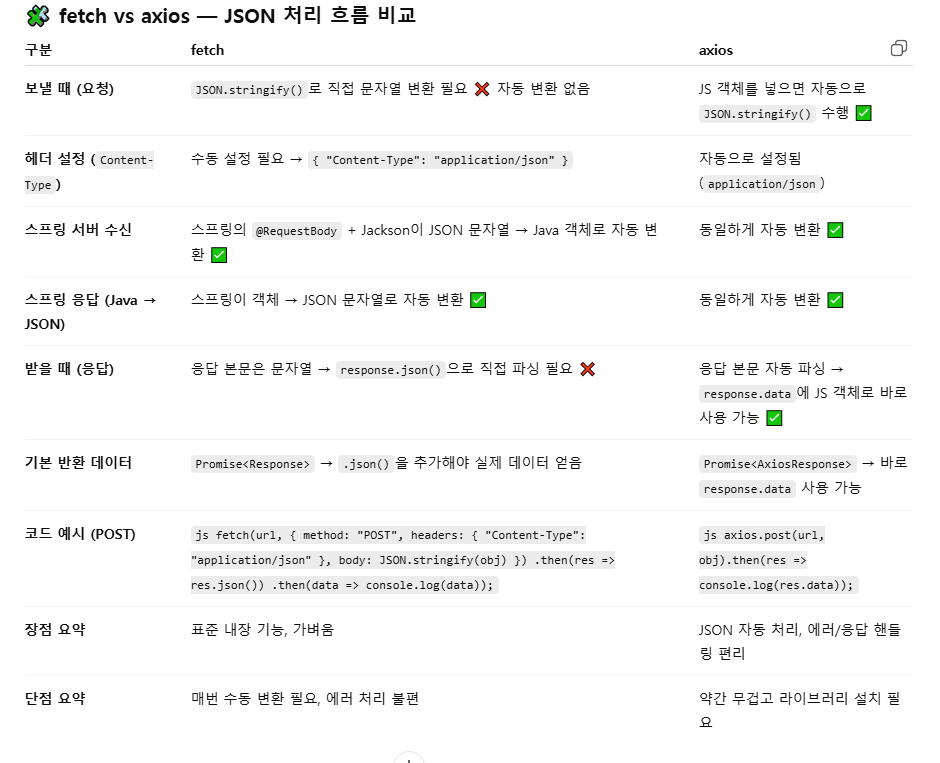

CORS는 다른 주소의 서버에 요청할 때 허락을 받아야 한다는 보안 규칙
JSON - “자바스크립트 객체 표기법”의 약자
제너릭(Generic) 타입은 **“타입을 나중에 결정하는 틀(template)”**
@ResponseBody는 스프링에서 데이터를 "그대로" HTTP 응답 본문으로 보내라는 의미
@RequestBody는 JSON 본문을 객체로 변환,
어노테이션이 없으면 폼이나 쿼리 파라미터를 객체로 바인딩한다.
✅ API는 “프로그램끼리 소통하는 모든 규칙”이고,
✅ REST API는 “그중에서도 HTTP 규칙(REST 원칙)을 따르는 방식의 API”다.

안녕하세요!
할루